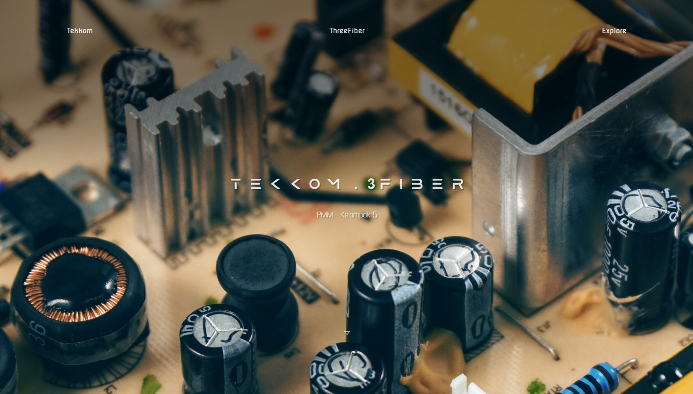

# Tekkom x ThreeFiber

This webpage serves as an informative platform, providing detailed explanations about the different components of a computer through the use of 3D simulations using React ThreeFiber accompanied by comprehensive descriptions. 

By exploring the interactive 3D objects, users can delve into the intricate details of each computer component, gaining insights into their visual attributes and functionalities. Whether it's understanding the physical appearance or comprehending the specific roles and operations of these components, this platform offers a comprehensive learning experience for individuals eager to expand their knowledge of computer systems.

This project made to fulfill one of my Final Project Assignment. Feel free to utilize it 🙌

---

[][node] [][bun1.0.16] [][react] [][next]

## Installation

See the [Docs][bun] for the guide to Bun. I used [Next JS][next] to initialize react-app and applying Server-Side Rendering.

Install dependencies:
```
bun i
```

Run in dev mode:
```
bun run dev
```

I didn't include any `scene.bin`, `scene.gltf` and `textures` of the 3D assets in this branch, so it might return error if you try to run it right away.

There are two options to solve this:
- Download required files from the link provided in the `license.txt` inside of public folder
- Download different assets and change their paths on `Viewer.jsx`

You also able to see and clone the build edition of this Repo on [TekkomFiber: Deploy][deploy]

## License

MIT

---

## Preview



Thanks to all my friends for helping me finish this project. Cheers! 🥂

[node]: https://nodejs.org/en/blog/release/v20.10.0
[bun]: https://bun.sh/docs
[bun1.0.16]: https://bun.sh/blog/bun-v1.0.16
[react]: https://react.dev/learn
[next]: https://nextjs.org/
[deploy]: https://github.com/SenzawaG/TekkomFiber.dev/tree/deploy